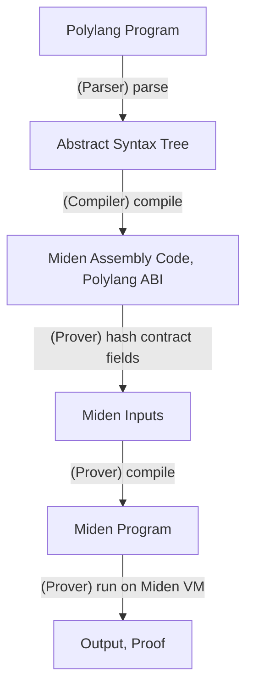
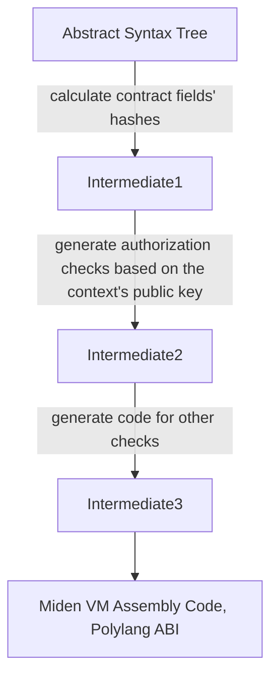
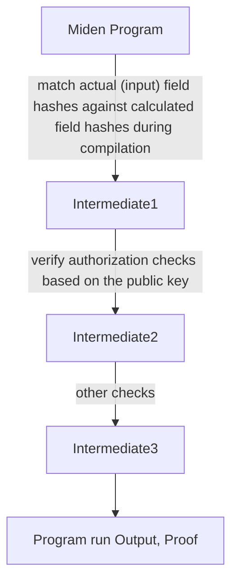

# Overview of Zero-Knowledge Proofs (ZKP)

## What is a Zero-Knowledge Proof/Protocol?

A Zero-Knowledge Proof or a Zero-Knowledge Protocol (ZKP) is a way of proving the validity of a statement without revealing the statement itself. Only the fact of the statement being
valid (i.e., true) is sufficient for a part (the Verifier) to validate the claims made by the other party (the Prover). Hence "Zero-Knowledge" since the statement itself is not part of
the verification process.

There are two main aspects for Zero-Knowledge protocols:
    1. Zero Knowledge - that no data other than the claim of of the validity of a statement is shared between the Prover and the Verifier.
    2. Provable Computation - the ability to validate that the computation ran as designed, and so the output of the computation can be trusted.

Zero-Knowledge protocols can be interactive or non-interactive. For most practical applications, non-interactive protocols are preferred. These can be classified into two 
main categories:

    * ZK-SNARKs (Zero-Knowledge Succinct Non-interactve Arguments of Knowledge). 
    * ZK-STARKs (Zero-Knowledge Scalable Transparent Argument of Knowledge).

For more details on ZKPs, and a comparison of zk-SNARKs vs zk-STARKS, please refer to the [zk-benchmarks website](https://zk-benchmarks.vercel.app/) along with the links in the [references](#references).

## What does Polylang use?

`Polylang` uses zk-STARK. `Polylang` programs are compiled to [Miden VM](https://github.com/0xPolygonMiden/miden-vm) assembly instructions, and proofs are generated on Miden. Miden is a zk-STARK based virtual
machine. For more details on Miden, please refer to their [official documentation](https://wiki.polygon.technology/docs/miden/user_docs/usage/).

## How does Polylang use Zero-Knowledge?

The lifecycle of a `Polylang` program is:

The `Polylang` compiler compiles the `Polylang` contract and program and *generates* code that can be verified and run on the Miden VM during the run stage. This includes generating code
to verify fields and functions using hashes, validating the inputs, and [Declarative Permissions](/docs/language-features/permissions).

Zooming in on the `Polylang` compiler compilaton stage:

The `Polylang` prover uses the available context from compilation for actual verification, running, and proof generation:

## References

    * https://ethereum.org/en/zero-knowledge-proofs/
    * https://en.wikipedia.org/wiki/Non-interactive_zero-knowledge_proof
    * https://blog.chain.link/zk-snarks-vs-zk-starks/